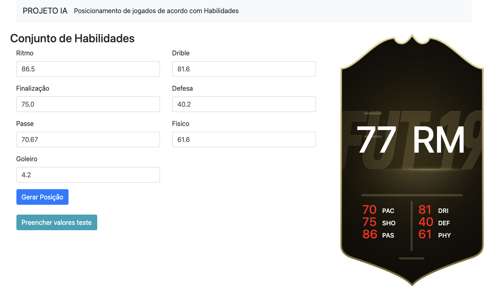

# ProjetoIAKnn

Este projeto foi desenvolvido como parte da disciplina de Inteligência Artificial. O objetivo é fornecer informações sobre um jogador de futebol, permitindo que o algoritmo classifique o jogador em uma posição específica e determine seu overall.

## Tecnologias Utilizadas

- **Front-end:**

  - HTML
  - CSS
  - JavaScript

- **Back-end:**
  - Python
  - FastAPI (Framework web para construção de APIs em Python 3.8+)
  - Uvicorn (Servidor web ASGI para Python)

## Funcionalidades

A aplicação coleta informações sobre um jogador de futebol e envia esses dados para o back-end. No back-end, o algoritmo KNN (K-Nearest Neighbors) é utilizado para classificar o jogador em uma posição específica e calcular seu overall com base em jogadores semelhantes.

## Algoritmo KNN (K-Nearest Neighbors)

O KNN é um método de aprendizado supervisionado não paramétrico utilizado para classificação e regressão. No contexto deste projeto, o KNN é empregado para classificar um jogador de futebol em uma posição específica com base na similaridade de suas características com outros jogadores no conjunto de dados.

O funcionamento básico do KNN envolve identificar os 'k' vizinhos mais próximos do jogador em termos de características relevantes, como habilidades técnicas, físicas e táticas. A classe ou valor atribuído pelos vizinhos mais próximos é então utilizado para determinar a posição e o overall do jogador em questão.

## Como rodar?

É uma aplicação bem simples de rodas. Está separada em duas partes, o front-end e o banck-end

1. **Pré-requisitos:**

- Python 3.8+
- Instalar as dependências com `pip install fastapi 'uvicorn[standard]'`

2. **Back-end**

A partir da pasta Back-end executar o seuginte comando:

```bash
  uvicorn player_classifier.app:app --reload
```

3. **Front-end**

Apenas abrir o arquivo `index.html` em qualquer navegador será suficiente. Pronto, só preencher as informações e precionar o botão **Gerar Posição**.

## Exemplo

